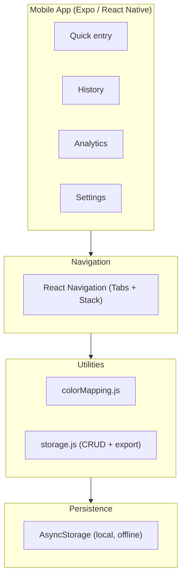
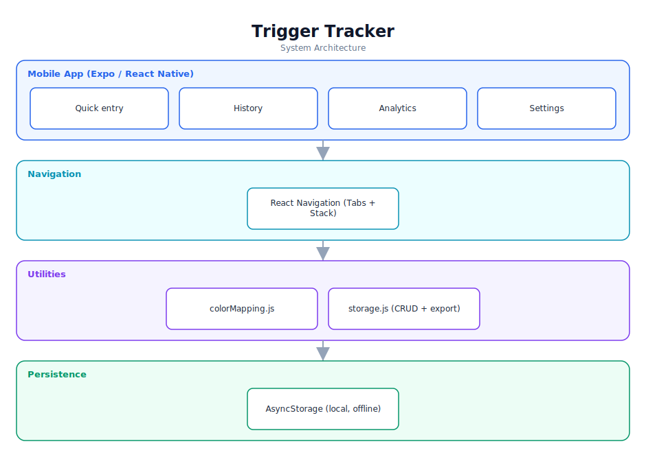

# Trigger Tracker — Software Documentation

> A private, offline-first mobile app for tracking behavioural triggers.

**Repository:** [`trigger-tracker`](https://github.com/Monametsi-s/trigger-tracker)  
**Type:** Cross-platform mobile application  
**Status:** Complete / functional (with tests)

---

## 1. Overview

Trigger Tracker is a single-user, offline-first mobile application that helps users log triggers related to negative habits and behaviours. It requires no account and stores everything locally; a quick-entry flow captures a 1–10 score (colour-mapped), feelings before/during/after, surroundings, and notes. The app includes analytics and JSON export, and ships with a Jest test suite (17 tests).

## 2. System Architecture

The diagram below shows the high-level architecture and how data flows between layers. It renders automatically on GitHub (Mermaid) and is also committed as a vector image ([`architecture.svg`](architecture.svg)).



<p align="center"></p>

### 2.1 Component responsibilities

| Layer | Responsibility |
|---|---|
| **Mobile app** | Four screens covering entry, history, analytics, and settings. |
| **Navigation** | Bottom tabs + stack navigation. |
| **Utilities** | Colour-scale logic and an AsyncStorage wrapper with export/import. |
| **Persistence** | Device-local AsyncStorage; no server, fully offline. |

## 3. Technology Stack

| Area | Technology |
|---|---|
| Framework | Expo + React Native |
| Navigation | React Navigation |
| Storage | AsyncStorage |
| Charts | Victory Native |
| Testing | Jest + RN Testing Library |

## 4. Assumed User Requirements

_These requirements are inferred from the project's purpose and feature set; they document the intended behaviour rather than a formally agreed specification._

### 4.1 Functional requirements

- **FR-01** — Record an event in roughly three taps with a 1–10 score and live colour preview.
- **FR-02** — Capture feelings (before/during/after), surroundings/tags, and notes.
- **FR-03** — Browse and edit/delete history with date filters.
- **FR-04** — Show weekly charts and colour-range breakdowns.
- **FR-05** — Export (and later import) all data as JSON for backup.

### 4.2 Representative user stories

- As a user working on a habit, I want to log a trigger instantly before the moment passes.
- As a private user, I want my data to stay on my phone with no account.
- As a user, I want to spot patterns in when triggers happen.

### 4.3 Non-functional requirements

- The app must work fully offline with no authentication.
- Entry must be fast (a few taps).
- Core utilities are covered by unit tests.

## 5. Assumed System Requirements

### 5.1 End-user (runtime) requirements

- A physical Android or iOS device, or an emulator/simulator.
- The **Expo Go** app installed (for development builds) or an installed production build.
- Approximately 50–150 MB of free storage for the app and local data.

### 5.2 Server / hosting requirements

- None — this project runs entirely on the client; no application server is required.

### 5.3 External services & API keys

- None — the application has no third-party service dependencies at runtime.

### 5.4 Developer / build requirements

- Node.js 18+ and npm (or yarn/pnpm).
- Git for cloning the repository.
- A code editor such as VS Code (recommended).
- Expo CLI; run tests with `npm test`.

## 6. Data Model

Each entry: { id (uuid), timestamp, score (1-10), color, feelings {before,during,after}, surroundings [], notes }. Stored as a JSON array in AsyncStorage.

## 7. Setup & Installation

```bash
git clone https://github.com/Monametsi-s/trigger-tracker.git
cd trigger-tracker/mobile-app
npm install
npm start   # scan QR with Expo Go
npm test    # run the 17-test suite
```

## 8. Assumptions & Future Considerations

- Finish the import feature (export already exists).
- Add reminders and pattern detection.
- Consider migrating to SQLite for large datasets.

---

<sub>This document was generated as part of a portfolio-wide documentation pass. User and system requirements are **assumed** from the codebase, README, and project intent, and should be validated against real product goals before being treated as authoritative.</sub>
